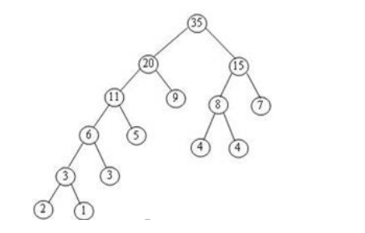

基本思路都是比较带权路径长度，然后检查是否存在一个编码是另外一个编码的前缀。

带权路径长度就是出现 **次数×编码位（bit）**，也就是最终需要编码文本的bit总和，比如

编码位数就是出现 2×5+1×5+4×3+5×3+7×2+3×4+4×3+9×2=98

然后写了三个版本:

1. 建树 Huffman_build.c

   1.1 检查是否最优

   按照Huffman算法，在内存中建立一颗Huffman树

   遍历树，到达叶子节点时，带权路径长度加上 **叶子节点所在深度（编码位）*出现频数（次数）**

   建树复杂度O(NlogN)，遍历复杂度O(N)

   1.2 检查前缀

   两两对比，检查是否存在一个编码是另外一个编码的前n位(前缀关系)，O(N^2^)

   运行M次，总的复杂度为O(M*N^2^)

   

2. 不建树 Huffman.c

   2.1 检查是否最优

   不需要建树也能获得最优带权路径长度

   按照Huffman算法，每一轮DeleteMin两次，Insert一次。同时将带权路径长度加上DeleteMin的两个数的和

   这样模拟运行Huffman算法，复杂度为O(NlogN)，常数会更小

   2.2 检查前缀

   与建树类似， O(N^2^)

   运行M次，总的复杂度为O(M*N^2^)

   

3. 不建树且优化检查前缀步骤 Huffman_optimize.c

   2.1 检查是否最优

   与不建树相同

   2.2 检查前缀

   将给出的编码按照字母序排列(qsort), 按照字母序排序后

   如果某一个编码是另一个编码的前缀，那么必然是这两个编码之间所有编码的前缀，

   example: 000 00001 00010 00011

   因此我们只需要检查每一个编码与下一个编码是否存在前缀关系

   排序复杂度O(NlogN), 检查复杂度O(N)

   运行M次，总的复杂度为O(M * N * log N)

